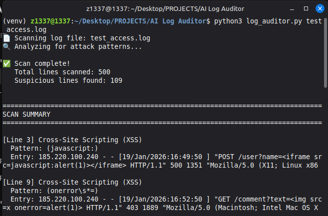
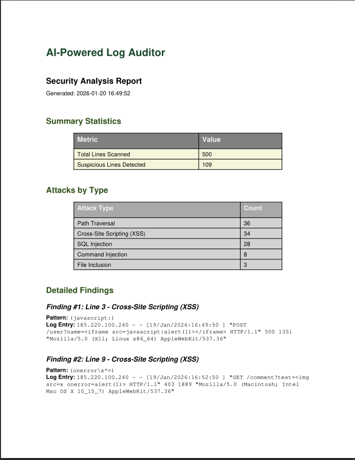
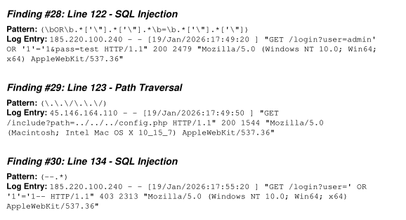
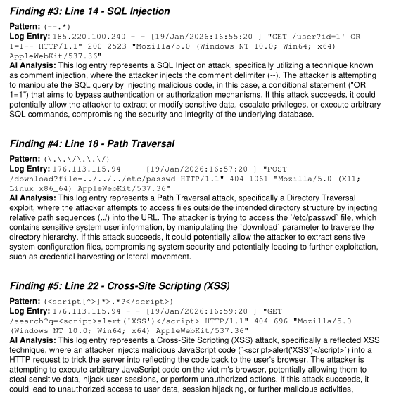

# AI-Powered Log Auditor

A cybersecurity tool that scans log files for security threats using pattern matching and AI-powered analysis. I built this to automate the process of finding malicious activity in server logs and generating professional security reports.

## What It Does

This tool scans log files in multiple formats and detects six common attack patterns:
- SQL Injection attempts
- Cross-Site Scripting (XSS) payloads
- Command Injection attacks
- Path Traversal attempts
- Authentication Bypass attempts
- File Inclusion vulnerabilities

**Supported Log Formats:**
- Apache access logs (auto-detected)
- Syslog format (auto-detected)
- Windows Event Logs (auto-detected)
- Generic text logs (fallback)

After detecting threats, it can use AI (Groq API - free, or OpenAI) to explain why each log entry is suspicious, then generates a professional PDF report with all findings.

**Configurable Detection Rules:**
- Customize attack patterns via YAML/JSON configuration files
- Add environment-specific detection rules
- Enable/disable specific attack types

## Technologies

- Python 3
- Groq API (free AI explanations)
- OpenAI API (paid alternative)
- ReportLab (PDF generation)
- Regex pattern matching

## Installation

```bash
# Create virtual environment
python3 -m venv venv
source venv/bin/activate

# Install dependencies
pip install -r requirements.txt
```

## Usage

### Generate Test Logs

```bash
python3 generate_test_logs.py test_access.log 500
```

This creates a test log file with a mix of normal traffic and attack patterns.

### Basic Scan (Pattern Matching Only)

```bash
python3 log_auditor.py test_access.log
```

### Scan with AI Explanations (Free with Groq)

```bash
export GROQ_API_KEY="your-groq-api-key"
python3 log_auditor.py test_access.log --ai --groq
```

### Generate PDF Report

```bash
python3 log_auditor.py test_access.log --ai --groq --pdf security_report.pdf
```

### Use Custom Configuration File

```bash
# Create config.yaml from config.example.yaml and customize patterns
python3 log_auditor.py access.log --config config.yaml --ai --groq
```

### Specify Log Format (or auto-detect)

```bash
# Auto-detect format (default)
python3 log_auditor.py access.log

# Manually specify format
python3 log_auditor.py syslog.log --format syslog
python3 log_auditor.py windows.log --format windows_event
```

## Getting a Free Groq API Key

1. Sign up at https://console.groq.com/
2. Go to API Keys section
3. Create a new key
4. Set environment variable: `export GROQ_API_KEY="your-key"`

## Screenshots

### Threat Detection in Action


### Security Analysis Report


### Detailed Threat Analysis


### AI-Powered Explanations


## Project Structure

```
AI Log Auditor/
├── log_auditor.py           # Main auditor tool
├── generate_test_logs.py    # Test log generator
├── requirements.txt         # Dependencies
├── config.example.yaml      # Example configuration file
├── README.md               # This file
└── screenshots/            # Project demonstration
```

## Features

- Detects 6+ attack types automatically
- **Multi-format log support** (Apache, syslog, Windows Event Logs)
- **Configurable detection rules** via YAML/JSON config files
- Auto-detects log format automatically
- Generates professional PDF reports
- AI-powered threat explanations
- Supports both Groq (free) and OpenAI
- Command-line interface for automation
- Test log generator for practice

## Security Notes

- Never commit API keys to version control
- Real production logs may contain sensitive data - handle appropriately
- Groq has generous free tier limits
- OpenAI is pay-per-use

## Use Cases

- SOC teams analyzing web server logs
- Security analysts investigating incidents
- Learning common attack patterns
- Automated log review workflows
- Security research and education
